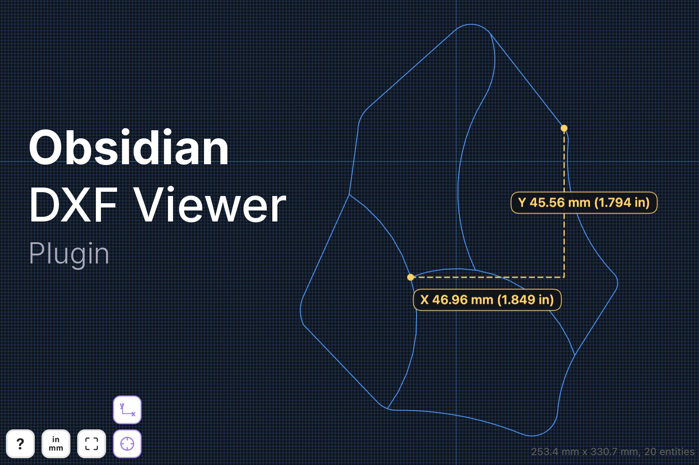

# DXF Viewer

View, measure, and embed DXF drawings in your vault.

## 📚 Features

- Open `.dxf` files in a dedicated Obsidian view.
- Render DXF embeds inside notes in reading mode with `![[drawing.dxf]]`.
- Pan, zoom, and reset the view with a zoom-all control.
- Measure between vertices, curve centers, and diameters of circles and arcs.
- Show direct distance or X/Y component measurements.
- Auto-detect drawing units from DXF metadata, with manual override when needed.

## 🛠️ Installation

### Community plugins

1. Open **Settings → Community plugins**.
2. Select **Browse**, search for **DXF Viewer**, and install it.
3. Enable **DXF Viewer**.

### Manual installation

1. Download `manifest.json`, `main.js`, and `styles.css` from the latest GitHub release.
2. Create `<your vault>/.obsidian/plugins/dxf-viewer/`.
3. Copy those three files into that folder.
4. Reload Obsidian and enable the plugin.

## 🚀 Usage

1. Open a `.dxf` file from your vault, or embed one in a note with `![[file.dxf]]`.
2. Drag on trackpad or click and drag with mouse to pan.
3. Pinch on trackpad or use `Cmd/Ctrl + scroll wheel` to zoom.
4. Select the ruler button to enter measurement mode.
5. Select two vertices, two curves, or a mix of both to measure distance.
6. Select a circle or arc to measure its diameter.
7. Double-click to clear the current measurement.
8. Select the units button if the drawing needs a manual inch/mm override.

## 📋 Notes

- Desktop-only for the initial release.
- Embed rendering is intended for reading mode.
- Measurement display can follow the drawing units or show both metric and imperial values.
- Grid spacing follows the selected drawing units.

## ✍️ Author

Developed by [Eric Weinhoffer](https://www.ericweinhoffer.com)

## 📄 License

MIT
